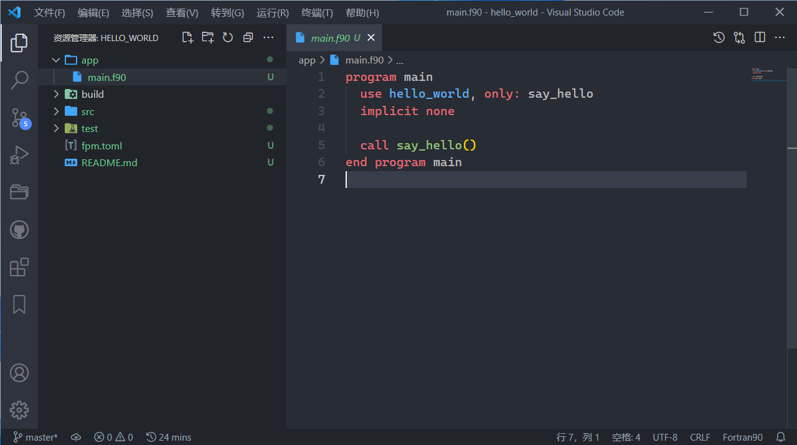

# fpm基本操作

Fortran Package Manager（fpm）是Fortran-Lang组织主导、为Fortran语言专门定制开发的免费、开源的包管理器和构建系统。

gfortran是Fortran编译器，当项目源代码文件增多时，我们需要依靠Make、CMake、XMake、fpm来管理和
构建项目，这会为我们节约很多构建代码的时间和精力。

我们可以前往[fpm仓库](https://github.com/fortran-lang/fpm)获取最新的安装教程和安装包，
并阅读相关文档。

我们也可以通过MSYS2安装fpm：
```sh
pacman -Ss fpm              # 查询名字中含“fpm”字符的包
pacman -S ucrt64/mingw-w64-ucrt-x86_64-fpm  # 安装fpm软件
```

现在，fpm已经有了面向用户的中文文档网页（[fpm.fortran-lang.org](https://fpm.fortran-lang.org/zh_CN/index.html)）了。

> 🔰 提示：fortran-lang/fpm不仅支持GFortran，还支持OneAPI和LFortran等其他Fortran编译器。

## 创建fpm项目演示

我们可以搭配命令行终端（cmd、pwsh、bash、fish）使用fpm，使用vs code编辑代码：
```sh
fpm new hello_world && cd hello_world       # 新建FPM项目并切换到文件夹下: hello_world
fpm build                   # 编译FPM项目
fpm run                     # 运行主程序🚀
fpm test --help             # 获取特定命令行参数的帮助文档
code .                      # 使用VS Code打开当前文件夹
...
```



> 🔰 提示：`fpm build`类似Visual Studio的Debug模式，`fpm build --profile release`类似Visual Studio的Release模式。